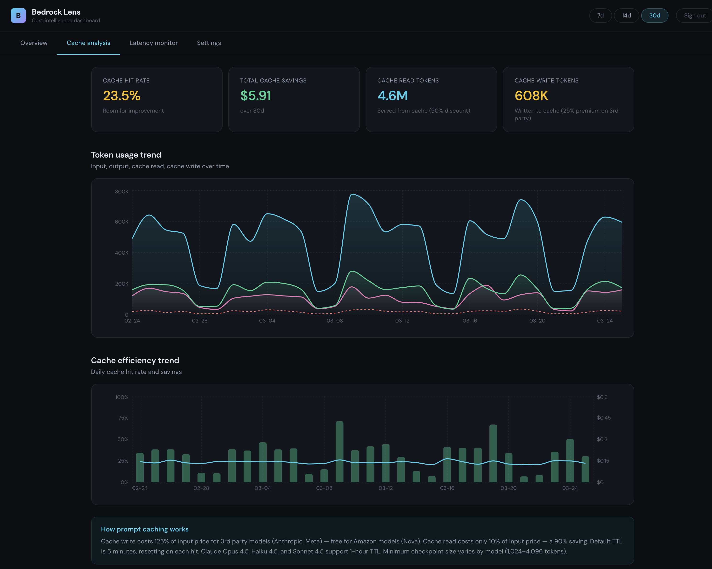

# Bedrock Lens

**Open-source cost intelligence dashboard for Amazon Bedrock**

Bedrock Lens gives you instant visibility into your Amazon Bedrock spending — model-level cost breakdown, prompt cache efficiency analysis, latency monitoring, and service tier usage — all in a single dashboard deployed to your own AWS account.

<!-- Add screenshots after capturing them:

-->

## Why Bedrock Lens?

AWS Cost Explorer shows Bedrock as a single line item. CloudWatch has the raw metrics but no cost context. To answer "how much did Claude Sonnet cost me this month?" or "is prompt caching actually saving money?", you need to manually cross-reference multiple AWS consoles and do the math yourself.

Bedrock Lens automates this. One CDK deploy, and you get:

- **Model-level cost breakdown** — See exactly how much each foundation model costs per day
- **Prompt cache efficiency** — Track cache hit rate and actual dollar savings from caching
- **Latency baseline monitor** — Set your acceptable threshold and see how many requests exceed it
- **Service tier analysis** — Understand your Standard vs Flex vs Priority usage distribution

All data stays in your AWS account. No external data transfer. No third-party access.

## Quick Start

### Prerequisites

- AWS account with Bedrock enabled
- Node.js 18+
- AWS CLI v2 configured (`aws configure`)
- AWS CDK CLI (`npm install -g aws-cdk`)

### Deploy

```bash
git clone https://github.com/YOUR_USERNAME/bedrock-lens.git
cd bedrock-lens
npm install
cdk bootstrap
cdk deploy --all
```

After deployment, the terminal outputs:

- **DashboardUrl** — Your dashboard URL (e.g., `https://d1234abcdef.cloudfront.net`)
- **UserPoolId** — Cognito User Pool ID
- **UserPoolClientId** — For frontend authentication
- **ApiUrl** — API Gateway endpoint

### Create your first user

```bash
aws cognito-idp admin-create-user \
  --user-pool-id <UserPoolId> \
  --username your@email.com \
  --temporary-password TempPass123!
```

Open the DashboardUrl, sign in, and set your new password. Data starts appearing after the collector runs (every hour).

## Architecture

```
┌─────────────────────────────────────────────────────────────────┐
│                     Customer AWS Account                         │
│                                                                  │
│  ┌──────────────┐   ┌──────────────┐   ┌──────────────────┐    │
│  │ CloudWatch   │   │Cost Explorer │   │  Bedrock API     │    │
│  │(Bedrock      │   │(Billing data)│   │(Model/Profile    │    │
│  │ metrics)     │   │              │   │  list)           │    │
│  └──────┬───────┘   └──────┬───────┘   └────────┬─────────┘    │
│         │                  │                     │              │
│         └──────────────────┼─────────────────────┘              │
│                            │                                     │
│                   ┌────────▼────────┐                           │
│  EventBridge ────►│ Collector Lambda│ (hourly)                  │
│  (hourly)         │ - Fetch metrics │                           │
│                   │ - Calculate cost│                           │
│                   │ - Write to DB   │                           │
│                   └────────┬────────┘                           │
│                            │                                     │
│                   ┌────────▼────────┐                           │
│                   │    DynamoDB     │                            │
│                   │ (metrics+config)│                            │
│                   └────────┬────────┘                           │
│                            │                                     │
│                   ┌────────▼────────┐                           │
│  Cognito ────────►│   API Lambda   │                            │
│  (auth)           │  + API Gateway │                            │
│                   └────────┬────────┘                           │
│                            │                                     │
│                   ┌────────▼────────┐                           │
│                   │   CloudFront   │ ◄──── User (browser)       │
│                   │   + S3 (React) │                            │
│                   └─────────────────┘                           │
└─────────────────────────────────────────────────────────────────┘
```

### Key Design Decisions

- **Data stays in your account** — No cross-account access, no external APIs. Collector Lambda uses IAM roles with read-only permissions for CloudWatch and Cost Explorer.
- **No prompt content collected** — Only CloudWatch metrics (token counts, latency, invocations) and Cost Explorer billing data. No model inputs or outputs are ever accessed.
- **Serverless and near-zero cost** — The dashboard itself costs ~$2-4/month to run.
- **Facts, not guesses** — The dashboard shows verified data and lets you make decisions. It doesn't claim to know which requests are "simple" or which models you should switch to.

## Features

### Overview

Daily cost trends by model, total spend, invocation counts, and service tier distribution at a glance.

<!--  -->

### Cache Analysis

Prompt cache hit rate, dollar savings from caching, cache write overhead, and daily efficiency trends.

<!--  -->

### Latency Monitor

Set your acceptable latency baseline (e.g., 5 seconds). See how many invocations exceed it.

<!--  -->

## What's Not Included (and Why)

| Feature | Reason |
|---------|--------|
| Quota/burndown monitoring | AWS provides `EstimatedTPMQuotaUsage` natively, and [aws-samples quota dashboard](https://github.com/aws-samples/sample-quota-dashboard-for-amazon-bedrock) covers this well |
| Model downgrade suggestions | Cannot verify prompt complexity without reading content, which violates our no-prompt-access principle |
| Specific dollar savings predictions | Requires assumptions about workload changes; we show facts instead |
| Multi-region collection | Collects from deployed region only; cross-region inference metrics are captured at the source region |
| Agents/KB/Guardrails cost | Each is a separate billing domain; planned for future enhancement |

## Tech Stack

| Layer | Technology |
|-------|-----------|
| IaC | AWS CDK (TypeScript) |
| Backend | Lambda (Python 3.12) |
| Storage | DynamoDB (on-demand) |
| API | API Gateway + Cognito |
| Frontend | React + Recharts |
| Hosting | S3 + CloudFront |

## Running Cost

| Resource | Monthly Cost |
|----------|-------------|
| Lambda (collector + API) | ~$0.60 |
| DynamoDB (on-demand) | ~$1.00 |
| API Gateway | ~$0.50 |
| S3 + CloudFront | ~$0.50 |
| Cost Explorer API | ~$0.72 |
| Cognito (< 50K MAU) | $0.00 |
| **Total** | **~$3.30/month** |

## Configuration

```bash
# Pause data collection
aws events disable-rule --name bedrock-lens-hourly-collection

# Resume
aws events enable-rule --name bedrock-lens-hourly-collection

# Tear down
cdk destroy --all
```

## Development

```bash
# Local frontend dev
cd frontend
cp .env.example .env
npm install && npm run dev

# Seed test data (no Bedrock cost)
python3 scripts/seed_test_data.py
python3 scripts/seed_test_data.py --clean

# Deploy frontend changes
cd frontend && npm run build && cd ..
cdk deploy BedrockLensFrontendStack

# Manually trigger collection
aws lambda invoke --function-name bedrock-lens-collector --payload '{}' output.json
```

## Bedrock Pricing Context

- **Input/Output tokens** — Per 1M tokens, output 3-5x more expensive
- **Prompt caching** — Cache writes 125% of input (3rd party) or free (Amazon); reads at 10% (90% discount)
- **Service tiers** — Standard (base), Flex (-50%), Priority (+75%), Batch (-50%)
- **Burndown rate** — Claude 3.7+ uses 5x quota per output token (throttling, not billing)

Pricing data in `infrastructure/config/models.ts` and `backend/shared/pricing.py`.

## Future Enhancements

- [ ] Optional CloudWatch quota dashboard (CDK flag)
- [ ] SNS cost alerts when thresholds are exceeded
- [ ] Multi-region data collection
- [ ] Agents/Knowledge Base/Guardrails cost tracking
- [ ] Historical data backfill from CloudWatch

## Contributing

Contributions welcome! See [CONTRIBUTING.md](CONTRIBUTING.md).

## License

MIT — see [LICENSE](LICENSE).

## Acknowledgements

- [aws-samples/sample-quota-dashboard-for-amazon-bedrock](https://github.com/aws-samples/sample-quota-dashboard-for-amazon-bedrock)
- [awslabs/bedrock-usage-analyzer](https://github.com/awslabs/bedrock-usage-analyzer)